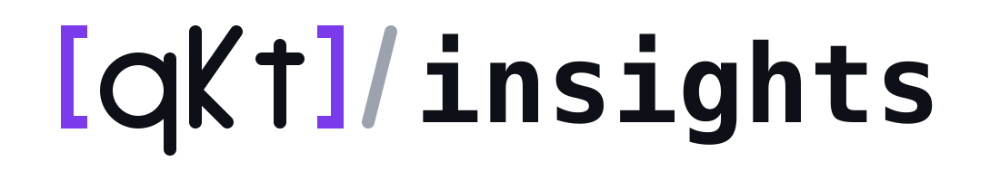

<p align="center">
  <picture>
    <source media="(prefers-color-scheme: dark)" srcset="docs/assets/qkt-insights-logo-dark.svg">
    
  </picture>
</p>

<h3 align="center">A self-hosted observability dashboard for the <a href="https://github.com/elitekaycy/qkt">qkt</a> trading engine.<br/>Every trade, order, log line, and equity curve — from every instance — in one place.</h3>

<p align="center">
  <a href="https://github.com/elitekaycy/qkt-insights/actions/workflows/ci.yml"></a>
  <a href="LICENSE"></a>
  <a href="https://github.com/elitekaycy/qkt-insights/pkgs/container/qkt-insights"></a>
</p>

---

> Live dashboard for [qkt](https://github.com/elitekaycy/qkt). Sibling project — same brand, same engineering style.

**qkt-insights** ingests the event stream a running [qkt](https://github.com/elitekaycy/qkt) instance already produces — signals, order lifecycle, fills, risk halts, equity snapshots, engine logs — persists it in SQLite, and serves a clean React dashboard behind a single admin login. Point any number of qkt instances (different accounts, different boxes) at one collector and switch between them from the sidebar.

The design promise: **observability never touches the trading hot path.** The qkt side enqueues onto a bounded in-memory queue and a background thread ships batches; if the collector is slow or down, events are dropped and the engine keeps trading. Telemetry is a best-effort tap, not a dependency.

```
qkt instance(s)               qkt-insights (one Node process)                browser
EventBus tap ── batched ───▶  collector → store (SQLite + FTS5) → api(+WS) ──▶ React app
InsightsSink   POST /ingest             single writer, one file
```

## Features

- **Health** — every reporting instance, last-event age, sequence position, sink counters, journal backlog, live/idle status.
- **Strategies** — per-strategy drill-down: equity chart, Sharpe, win rate, max drawdown, return, trades, recent logs.
- **Trades** — every fill, filterable by strategy and symbol.
- **Logs** — engine logs shipped from qkt with level filters, full-text search, and a live tail.
- **Search** — FTS5 full-text search across all events and logs: symbols, order ids, halt reasons, log text.
- **Equity** — all strategies on one normalized comparison chart.
- **Single-admin auth** — username + password from env, hashed with argon2 at startup, signed httpOnly session cookie; ingest guarded by a bearer token.

## Quick start (Docker)

```bash
# 1. Run it
docker run -d --name qkt-insights \
  -p 8420:8420 \
  -v insights-data:/data \
  -e INSIGHTS_DB=/data/insights.db \
  -e INGEST_TOKEN=change-me \
  -e ADMIN_USERNAME=admin \
  -e ADMIN_PASSWORD='<your password>' \
  -e SESSION_SECRET='<long random string>' \
  ghcr.io/elitekaycy/qkt-insights:latest run

# 2. Open http://localhost:8420 and sign in
```

Or with compose: copy `docker-compose.yml`, set the four env vars, `docker compose up -d`. The production image exposes `GET /healthz` and includes a Docker `HEALTHCHECK`; use an immutable `:v*` or `:sha-*` tag for pinned deployments and `:latest` only for tracking `main`.

## Run modes

One image, one entrypoint, three shapes — pick with the container command:

| mode | what runs | use it for |
|---|---|---|
| `collect` | store + `POST /ingest` | headless recorder on a separate box |
| `serve` | collect + REST/WS API | API-only, UI hosted elsewhere |
| `run` *(default)* | serve + the web app | the full thing on one port |

## Connecting a qkt instance

In your `qkt.config.yaml` (requires qkt ≥ 0.40.0):

```yaml
insights:
  enabled: true
  url: "http://insights-host:8420/ingest"
  instance_id: "qkt-prod"          # how this instance appears in the sidebar
  token: "${INGEST_TOKEN}"
  events: [trade, order, signal, risk, position, state, deal, lifecycle, log] # sink health is emitted automatically while insights is enabled
```

Each family is opt-in. Sink health snapshots report sent/failed/dropped/queued telemetry automatically; qkt versions with the local insights journal also report whether replay is enabled and how many rows are pending. `state` polls broker account/position truth, `deal` backfills durable broker deal history where the broker supports it, `lifecycle` streams strategy start/stop events, and `log` attaches a logback appender that streams INFO+ engine logs. The old `snapshot` family is accepted by older configs but no longer wires an emitter in current qkt. Omit `enabled` or set it `false` and qkt wires nothing: no thread, no queue, zero overhead.

## Architecture

A pnpm workspace of small, single-purpose packages:

| package | responsibility |
|---|---|
| `packages/contract` | the wire truth — Zod schemas for every envelope type; validation at the boundary, types everywhere else |
| `packages/store` | the only SQLite writer — WAL, FTS5, forward-only migrations, order-state folding, stats (Sharpe, drawdown, win rate) |
| `packages/collector` | `POST /ingest` — bearer auth, Zod-validated, idempotent on event id, seq-aware against out-of-order delivery |
| `packages/api` | REST + WS `/live` behind the session guard |
| `apps/web` | React + Vite + Tailwind dashboard |
| `src/server.ts` | one entry, boots subsystems by mode |

Design notes live in [`docs/specs/`](docs/specs/) and the implementation plans in [`docs/plans/`](docs/plans/).

## Development

```bash
pnpm install
pnpm test            # vitest — real SQLite, real HTTP, no mocks
pnpm build:all       # tsc project references + vite web build
pnpm --filter @qkt-insights/web dev    # web dev server proxying to :8420
node dist/src/server.js serve          # backend against ./insights.db
```

Conventions: TypeScript strict, smallest reasonable change, no mocks in e2e tests,
commit subjects only. CI runs the full suite on every push and PR; merges to `main`
publish `ghcr.io/elitekaycy/qkt-insights:latest`.

## Contributing

Issues and PRs welcome. Branch off `dev` (the default branch), keep PRs focused, and
make sure `pnpm test` and `pnpm build:all` pass. If you're adding an event type,
start in `packages/contract` — the schema is the contract both sides compile against.

## License

[Apache 2.0](LICENSE) © Dickson Anyaele
