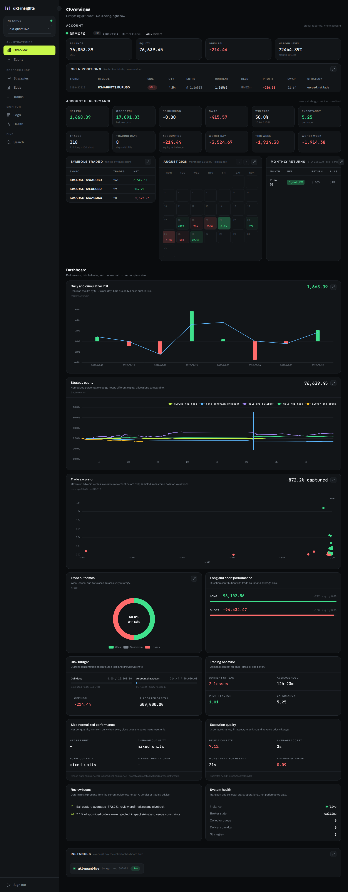
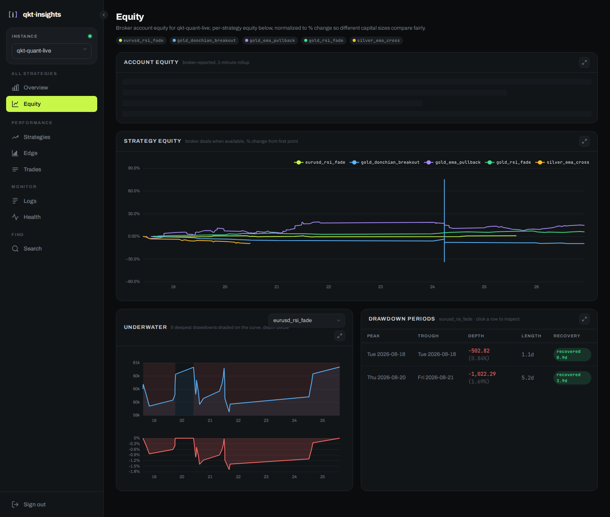
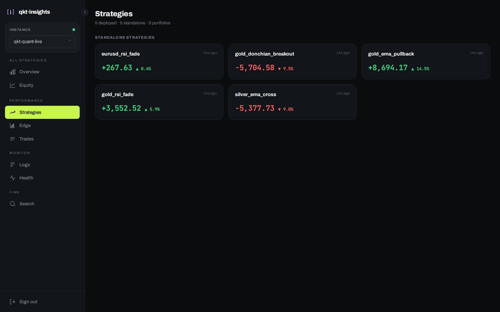
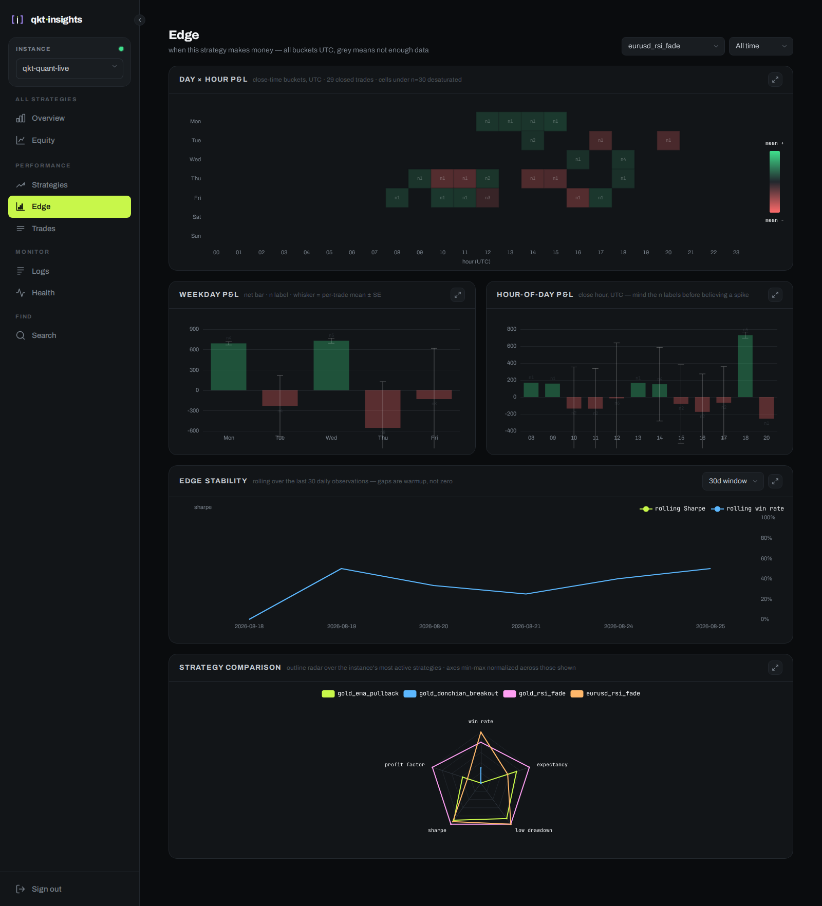
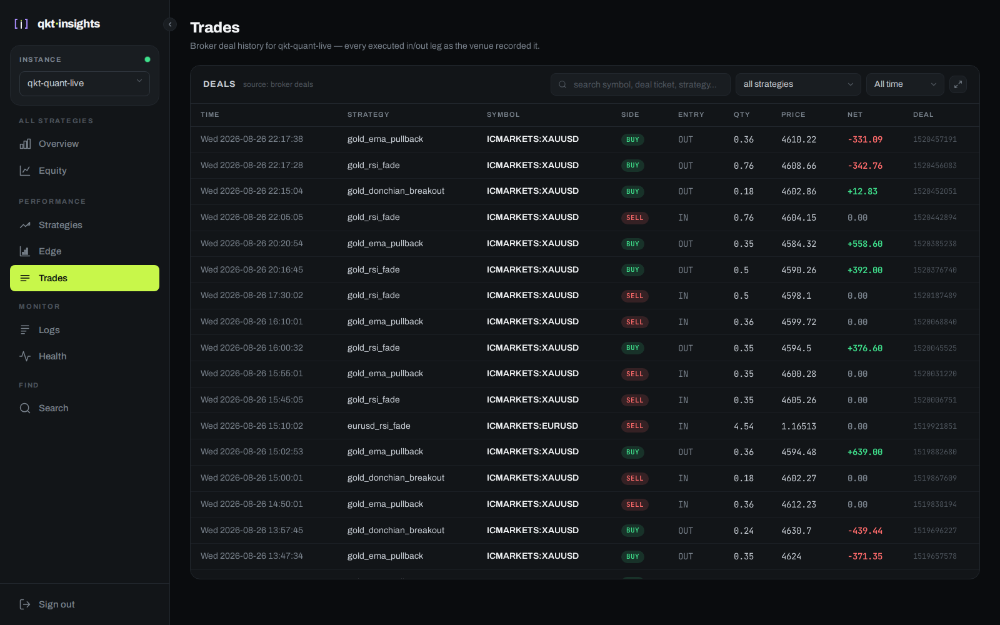
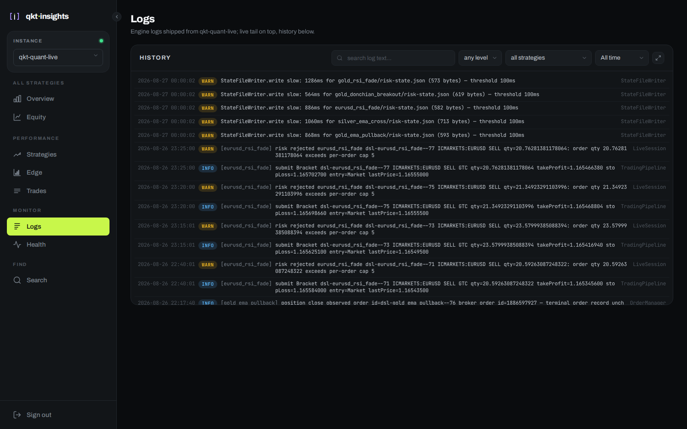
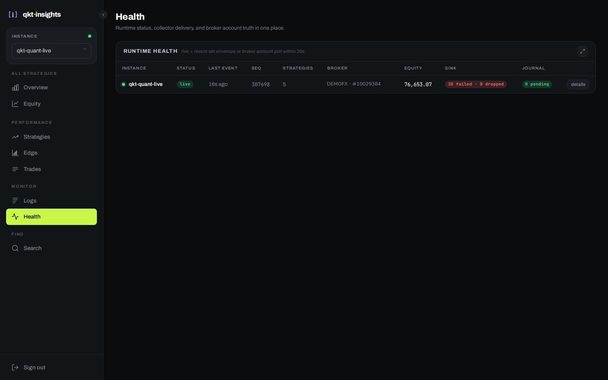
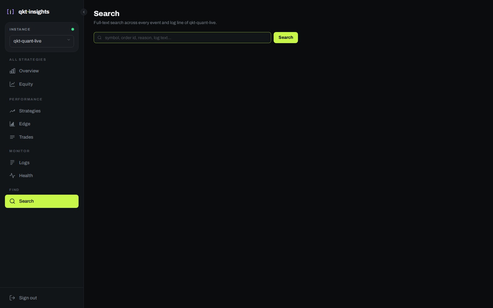

# Screens

A tour of every page in the dashboard. Screenshots are from a live instance; the
account number, broker name, and account holder on **Overview** and **Health** are
placeholders — everything else (balance, positions, strategies, trades, logs) is real.

## Overview

Everything the selected instance is doing right now: account snapshot, open
positions, account performance (net P&L, win rate, expectancy, drawdown), a
trading calendar, monthly returns, and a full performance dashboard —
daily/cumulative P&L, strategy equity, trade excursion, outcomes, risk budget,
trading behavior, and execution quality — down to every reporting instance.

## Equity

Broker account equity over time, per-strategy equity normalized to % change,
underwater curve, and drawdown periods.

## Strategies

Every standalone and portfolio strategy on the instance, with live P&L and return.

## Edge

When a strategy makes money: day-of-week × hour P&L heatmap, weekday/hour bars with
per-bucket sample size, and rolling edge stability. Buckets under 30 trades render
desaturated — thin slices are noise, and the UI says so.

## Trades

Every executed fill, sourced from broker deal history, filterable by strategy and
symbol.

## Logs

Engine logs shipped from the instance, with level filters and full-text search.

## Health

Runtime status for every reporting instance: last event age, sequence position,
sink delivery counters, and journal backlog.

## Search

Full-text search across every event and log line — symbols, order ids, halt
reasons, log text.

